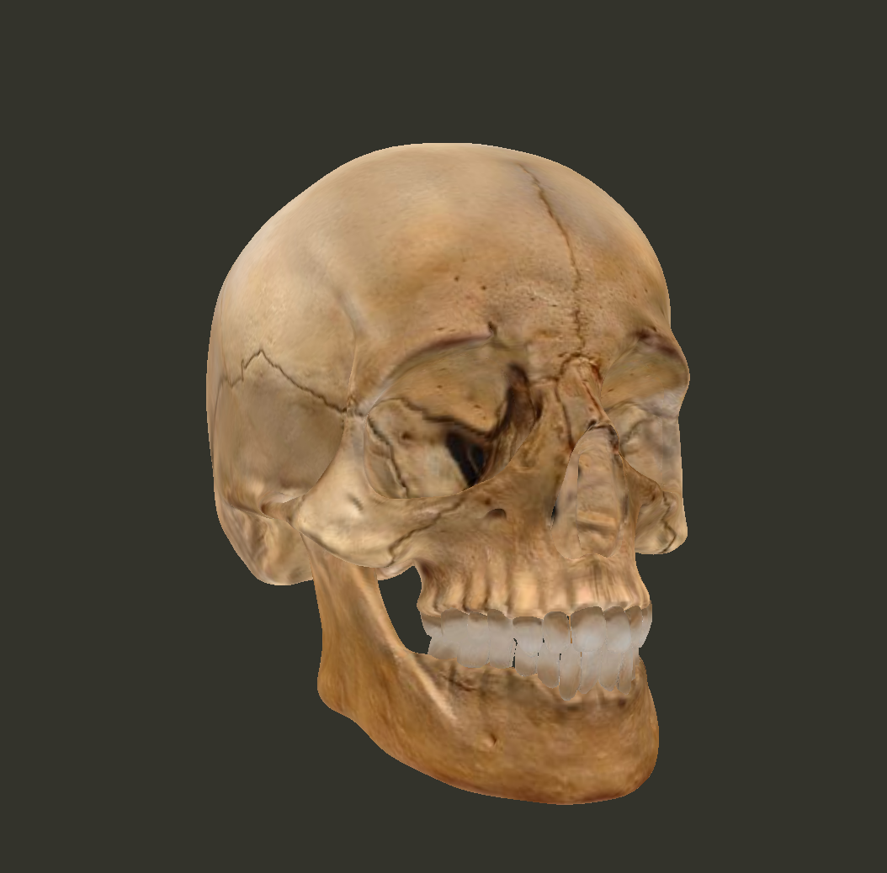

# Scop
Scop is a 42-school graphics project.
The goal of this project is to discover the basics of OpenGL by rendering a 3D object from a .obj file, without using high-level math or rendering libraries.
The program loads a 3D model, displays it in real time, and allows the user to interact with it using the keyboard 🎮.

## ⚙️ Mechanism

Scop uses OpenGL 3.3 to render a 3D object with the following pipeline:

- 📦 Parsing of `.obj` files (vertices, normals, UVs)
- 🎨 Optional loading of materials and textures
- 🧱 Construction of vertex and index buffers (VBO / EBO)
- 🧠 Rendering using custom vertex and fragment shaders
- 📷 Camera management using view and projection matrices
- 🕳️ Depth testing and face culling
- 💡 Basic lighting (diffuse lighting with a toggle)

## Instruction
```bash
  make
  ./Scop ./ressources/file.obj ./textures/tex1 ./textures/tex2 ... # Textures are optionnal
```
| Action                             | Key        |
|------------------------------------|------------|
| Move forward / backward            | W / S      |
| Move left / right                  | A / D      |
| Move up / down                     | Q / E      |
| Move the camera                    | Arrows     |
| Rotate the object                  | M          |
| 90° rotation around X / Y / Z axis | X / Y / Z  |
| Reset camera position              | SPACE      |
| Change texture                     | T          |
| Enable / disable lighting          | L          |
| Rendering modes                    | P          |
| Exit program                       | ESC        |

The object can be rendered in different modes:  
- Triangles (default)  
- Lines  
- Points  
     
## Pictures

▶ [Full demo video](https://youtu.be/rLU4pWJ_AfI)

#### Different textures



#### No texture files but many material in .mtl file 

#### Other object 

#### With a spotlight

#### More and more point 

#### For Star Wars fan

